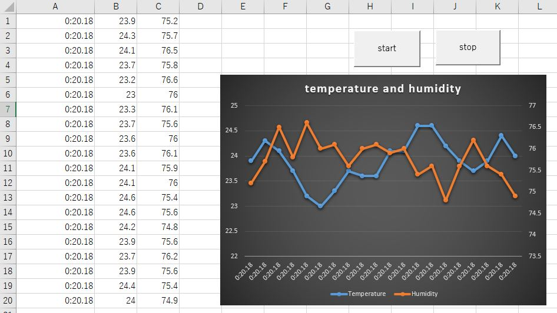

# TaniDLL Real-Time Excel Logger Demo

This is a demonstration project showing how to receive data from multiple ESP32 devices and visualize it in real-time using Excel VBA and TaniDLL.

---

## 🎥 Demo Overview

- Multiple ESP32 devices send sensor data via serial
- Excel VBA receives data using TaniDLL
- Data is plotted in real-time on an Excel chart
- Ring buffer (20 samples) keeps the graph updating continuously

---

## 📊 Features

- Real-time serial communication from multiple COM ports
- Works with Excel VBA (32-bit / 64-bit)
- Simultaneous data acquisition (COM5, COM17)
- Automatic chart updates
- Lightweight and simple implementation

---

## 🖼️ Example Output

---

## 🧩 System Configuration

